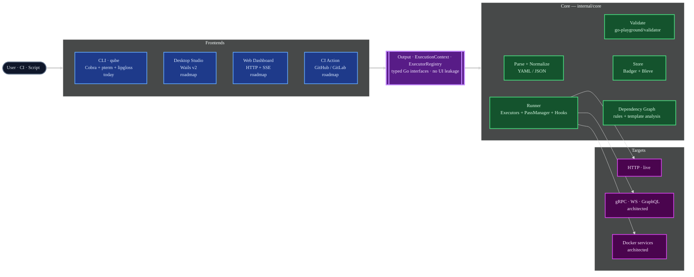
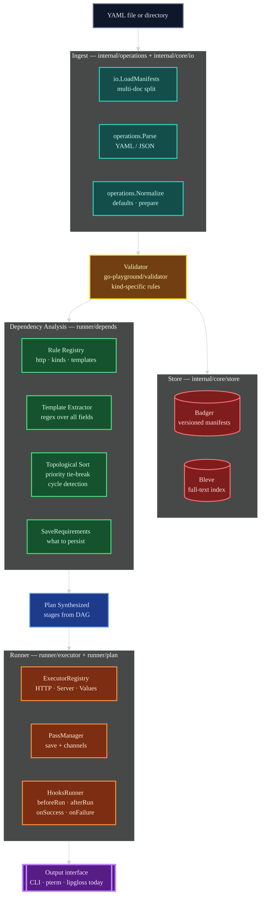
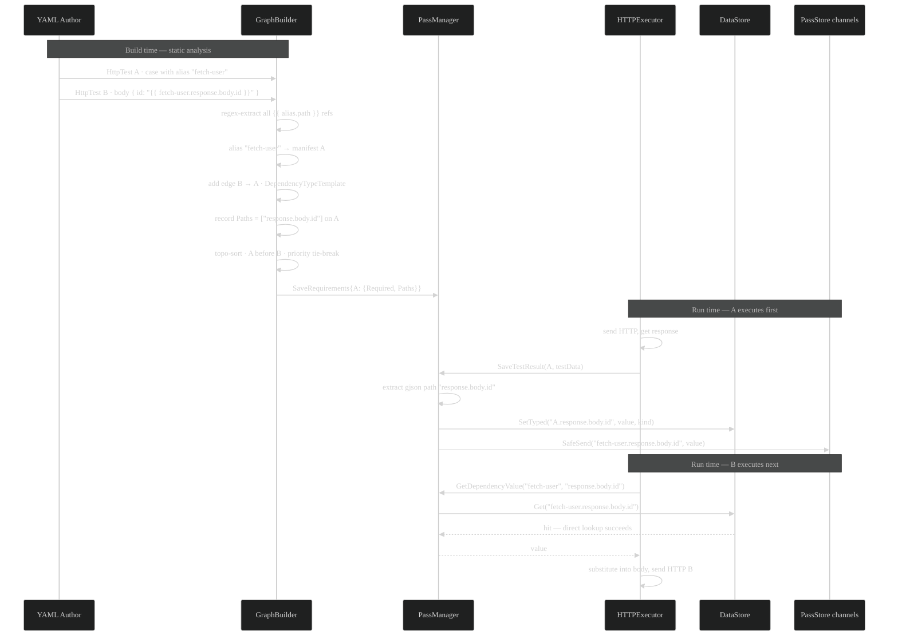
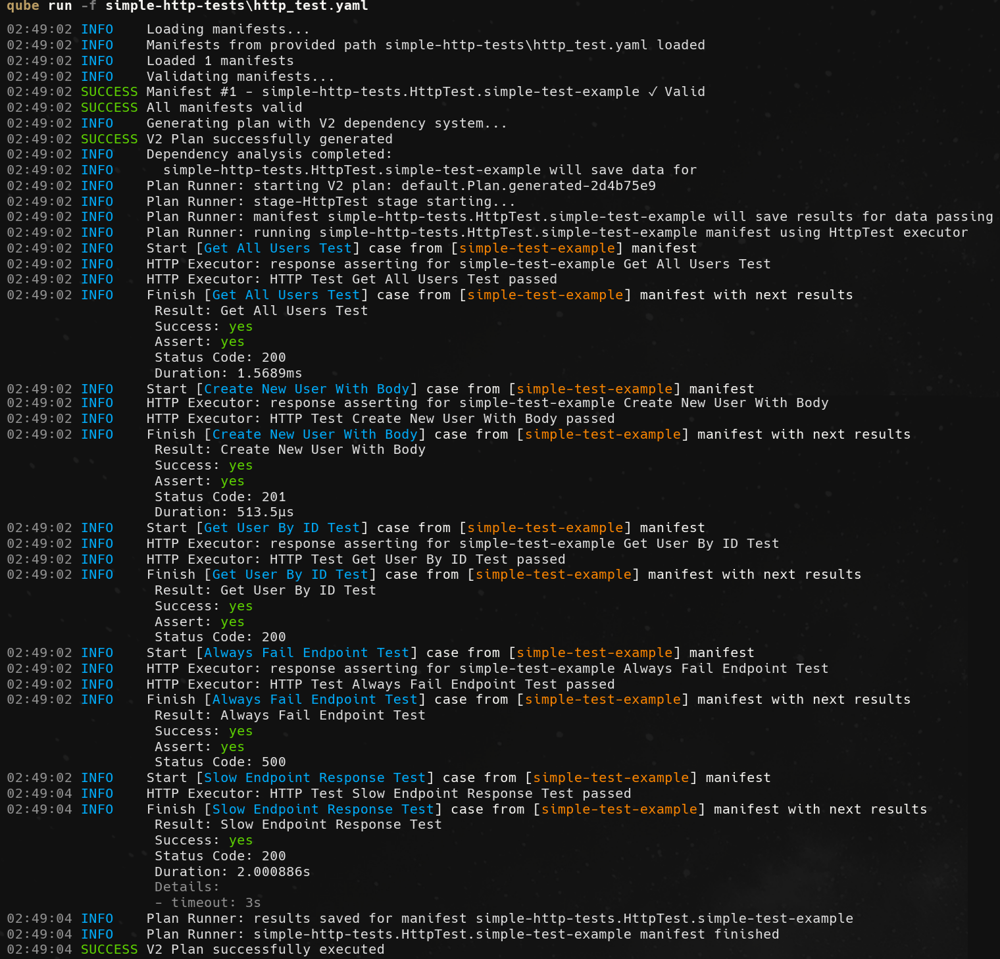
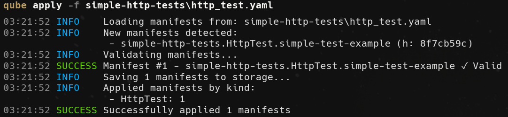
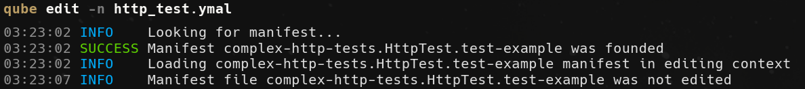

# ApiQube

> A unified, declarative, frontend-agnostic testing engine for modern microservice systems — one core, many frontends, any protocol.

**Source code:** [github.com/apiqube/cli](https://github.com/apiqube/cli)


---

## Contents

- [The Problem](#the-problem)
- [Overview](#overview)
- [Architecture](#architecture)
  - [System Overview — Frontend-Agnostic Core](#system-overview--frontend-agnostic-core)
  - [Apply & Run Pipeline](#apply--run-pipeline)
  - [Dependency Graph & Data Flow](#dependency-graph--data-flow)
- [The Manifest Model](#the-manifest-model)
  - [The Kubernetes-style Shape](#the-kubernetes-style-shape)
  - [Kinds — Live and Architected](#kinds--live-and-architected)
  - [Priority Ordering](#priority-ordering)
  - [Anatomy of an HttpTest](#anatomy-of-an-httptest)
  - [Cross-Manifest Referencing via Aliases](#cross-manifest-referencing-via-aliases)
  - [Plan — Multi-stage Orchestration](#plan--multi-stage-orchestration)
  - [Values, Server, Service](#values-server-service)
- [The Template DSL](#the-template-dsl)
- [Under the Hood — the Clever Bits](#under-the-hood--the-clever-bits)
  - [Auto-Dependency Graph from Template References](#auto-dependency-graph-from-template-references)
  - [SaveRequirements via Static Analysis](#saverequirements-via-static-analysis)
  - [PassManager — Dual-Mode Sync/Async Data Flow](#passmanager--dual-mode-syncasync-data-flow)
  - [Versioned Local Storage — Badger + Bleve](#versioned-local-storage--badger--bleve)
  - [Frontend-Agnostic Core in Practice](#frontend-agnostic-core-in-practice)
- [CLI Reference](#cli-reference)
- [Example Manifests](#example-manifests)
- [Running It — Real CLI Output](#running-it--real-cli-output)
- [Tech Stack](#tech-stack)
- [Roadmap & Vision](#roadmap--vision)
- [What I Learned](#what-i-learned)
- [Status](#status)

---

## The Problem

API testing is fragmented. A real project that ships HTTP, gRPC, WebSocket and GraphQL endpoints through a handful of services ends up with a drawer full of disconnected tools: **Postman** for HTTP, **grpcurl** for gRPC, **wscat** for WebSocket, **k6** or **Vegeta** for load, **Newman** to shoe-horn Postman into CI, and a scatter of ad-hoc shell scripts to glue the results together. Each tool has its own config format, its own mental model, its own storage, its own assertion DSL, and its own idea of how to pass data from one call into the next. None of them treat test plans as first-class versioned artifacts the way a build system treats build files.

ApiQube is an attempt to collapse that sprawl into a **single declarative engine** whose *intent* stays the same regardless of protocol or frontend. You describe *what* to test in Kubernetes-style YAML manifests, and the engine handles parsing, validation, versioned storage, full-text search, dependency analysis, execution, result extraction, cross-test data passing, metrics, hooks, and teardown — through the same abstractions whether the caller is a CLI, a desktop studio, a web dashboard, a language-native library, or a CI action. The CLI you see today is one frontend, not the product.

---

## Overview

ApiQube is built around one principle: **a testing engine should be protocol-agnostic, frontend-agnostic, and treat test plans as versioned first-class artifacts.** Every design choice in the codebase follows from that.

- The **core** lives in `internal/core` and knows nothing about the terminal, about prompts, about colours, or about any particular user interface. It exposes typed Go interfaces (`Executor`, `ExecutionContext`, `ExecutorRegistry`, `Output`) and expects callers to provide concrete implementations.
- The **CLI** (`qube`) lives in `cmd/cli` and `ui/cli`. It is one implementation of those interfaces — a `pterm` + `lipgloss`-based terminal output wired into a Cobra command tree. Any future frontend (a Wails desktop studio, an HTTP+SSE web dashboard, a GitHub Action, a Go / JS / Python client library) plugs into the same core through the same interfaces.
- **Manifests** are Kubernetes-shaped YAML files with `version / kind / metadata / spec`. They are parsed, validated, hashed, stored in an **embedded BadgerDB** under the platform's XDG data directory, and indexed in **Bleve** for full-text search. Every `apply` creates a new version; `rollback` and `cleanup` move the version pointer explicitly.
- **Execution** is driven by a **rule-based dependency graph** built from three sources: explicit `dependsOn`, per-kind rules, and — the interesting one — **automatic analysis of `{{ alias.path }}` template references** sprinkled through the spec. The graph is topologically sorted with cycle detection and kind-priority tie-breaking, which means infrastructure manifests (Values, Server, Service) always run before tests, and tests that reference another test's response always run after it.
- **Data passing** between manifests is handled by a dedicated `PassManager` that works in two modes: synchronous (`DataStore` snapshot + `gjson` path extraction) and asynchronous (`PassStore` channels with `select` on `ctx.Done()`), with a three-level fallback chain.

Today the engine ships a single protocol executor — **HTTP** — with the full feature set: templates, fake data generation, parallel cases, per-case timeouts, assertions, save/extract, metrics. The rest of the roadmap — gRPC, WebSocket, GraphQL, load testing, Docker-native service orchestration, plugin marketplace, desktop and web frontends, language-native libs, CI action — is already encoded as constants, interfaces and manifest-kind slots in the codebase, waiting for executors to be written behind the same boundary.

---

## Architecture

The project is organized around three hard boundaries: **frontends ↔ core**, **core ↔ storage**, and **core ↔ targets**. Each boundary is an interface, not a concrete type. Three diagrams below, each telling a different part of the story — the system as a whole, the execution pipeline of a single run, and the mechanics of how dependencies and cross-test data passing actually work at runtime.

### System Overview — Frontend-Agnostic Core

A zoomed-out view of how the pieces fit. The core is a library with typed interfaces; the CLI is one concrete frontend. Every other surface in the roadmap — desktop UI, web dashboard, CI action, language-native libs — plugs into the same contracts through the same `ExecutionContext` and `Output` interfaces.



### Apply & Run Pipeline

What actually happens when a user runs `qube run -f ./tests`. Every box is a real step in the code — parsing, validation, optional persistence, dependency-graph construction, plan synthesis, and finally execution through per-kind executors coordinated by the `PassManager`.



### Dependency Graph & Data Flow

The clever bit. A concrete trace of what happens when one test case references another's response body via `{{ fetch-user.response.body.id }}`. Every arrow is a real call across a real boundary. Left column is build-time (static analysis before execution starts), right column is run-time (while the plan executes).



The synchronous path in the diagram is the fast happy case; when B runs and the value is already in `DataStore`, `GetDependencyValue` returns immediately. When B races ahead of A (parallel stage, concurrent execution), the same call falls through to `WaitForDependency`, which performs a `select` on the dedicated `PassStore` channel and `ctx.Done()`. The caller never knows which mode it was — the fallback is a three-level chain inside `PassManager`.

---

## The Manifest Model

### The Kubernetes-style Shape

Every manifest inherits the same skeleton — intentionally mirroring `kubectl` so that anyone who has touched Kubernetes can read one without a tutorial:

```go
// internal/core/manifests/kinds/base.go
type BaseManifest struct {
    Version  string `yaml:"version"  validate:"required,eq=v1"`
    Kind     string `yaml:"kind"     validate:"required,oneof=Plan Values Server Service HttpTest HttpLoadTest"`
    Metadata `yaml:"metadata"`
}

type Metadata struct {
    Name      string `yaml:"name"      validate:"required,min=3"`
    Namespace string `yaml:"namespace"`
}

type Dependencies struct {
    DependsOn []string `yaml:"dependsOn" validate:"omitempty,min=1,max=25"`
}
```

The `Manifest` interface is the only contract the runner needs. Anything implementing it can be loaded, stored, indexed, and executed:

```go
// internal/core/manifests/interface.go
type Manifest interface {
    GetID() string           // namespace.Kind.name
    GetKind() string
    GetName() string
    GetNamespace() string
    Index() any              // Bleve document for search
    GetMeta() Meta           // hash, version, timestamps, creator
}
```

Optional interfaces let a kind opt into extra behaviour — `Defaultable` for default-field population, `Prepare` for normalization, `Dependencies` for explicit `dependsOn`. This is pure duck-typing through Go interfaces: the runner calls `if d, ok := m.(Dependencies); ok { ... }` and kinds that don't implement the optional bits simply don't participate in those passes.

### Kinds — Live and Architected

The full set of kind constants already exists in the codebase. HTTP is live end-to-end. The rest are either structural-only (schema is defined, runtime executor pending) or reserved slots for the roadmap:

| Group | Kind | Status |
|---|---|---|
| **Infrastructure** | `Values` | ✅ live |
| | `Server` | ✅ live — declares a remote target |
| | `Service` | 🏗️ structural — Docker container schema defined, runtime pending |
| **Plan** | `Plan` | ✅ live — stages, hooks, strict/parallel modes |
| **HTTP** | `HttpTest` | ✅ live — full executor, templates, assertions, save |
| | `HttpLoadTest` | 🏗️ structural — schema defined, runtime pending |
| **gRPC** | `GRPCTest` · `GRPCLoadTest` | 📋 reserved |
| **WebSocket** | `WSTest` · `WSLoadTest` | 📋 reserved |
| **GraphQL** | `GraphQLTest` · `GraphQLLoadTest` | 📋 reserved |

The reserved kinds are not wishful thinking in a README — they are real constants declared in `internal/core/manifests/interface.go`, already woven into the `Kind` naming convention and the priority map. When a new executor is implemented for any of them, the parser, validator, store, graph builder, and plan runner don't need changes: they work against `Manifest`, not against concrete types.

### Priority Ordering

When the topological sort has a tie — two manifests with no dependency between them — it breaks the tie by **kind priority**, which is a deliberate knob that encodes "infrastructure always comes before tests":

```go
// internal/core/manifests/kinds/priority.go
var PriorityMap = map[string]int{
    // Infrastructure
    ValuesKind:       10,

    // Application
    ServerKind:       100,
    ServiceKind:      110,

    // Tests
    HttpTestKind:     200,

    // Load tests
    HttpLoadTestKind: 300,
}
```

The guarantee that falls out of this: even without a single line of `dependsOn`, a directory containing a `Values` manifest, a `Server` manifest and an `HttpTest` manifest will execute them in that order. You get topology for free from the semantics of the kinds themselves.

### Anatomy of an HttpTest

A test is a manifest whose `spec` is a list of cases, and a case is the smallest addressable unit of work:

```go
// internal/core/manifests/kinds/tests/base.go (simplified)
type HttpCase struct {
    Name     string            `yaml:"name"`
    Alias    *string           `yaml:"alias"`    // referencable handle for cross-case data flow
    Method   string            `yaml:"method"`   // GET POST PUT PATCH DELETE
    Endpoint string            `yaml:"endpoint,omitempty"`
    Url      string            `yaml:"url,omitempty"`       // absolute override for target
    Headers  map[string]string `yaml:"headers,omitempty"`
    Body     map[string]any    `yaml:"body,omitempty"`
    Assert   []*Assert         `yaml:"assert,omitempty"`
    Save     *Save             `yaml:"save,omitempty"`
    Timeout  time.Duration     `yaml:"timeout,omitempty"`
    Parallel bool              `yaml:"async,omitempty"`    // run concurrently inside the manifest
}

type Assert struct {
    Target   string `yaml:"target"`   // status | body | headers
    Equals   any    `yaml:"equals,omitempty"`
    Contains string `yaml:"contains,omitempty"`
    Exists   bool   `yaml:"exists,omitempty"`
    Template string `yaml:"template,omitempty"`   // compared against a resolved template
}

type Save struct {
    Request  *SaveEntry `yaml:"request,omitempty"`
    Response *SaveEntry `yaml:"response,omitempty"`
}

type SaveEntry struct {
    Body    map[string]string `yaml:"body,omitempty"`    // saveKey → gjson path
    Headers []string          `yaml:"headers,omitempty"`
}
```

`Save` is the explicit way to persist fields. The implicit way is what the `PassManager` does automatically from detected template references — the two coexist.

### Cross-Manifest Referencing via Aliases

An `alias` on a case turns it into a named handle that any other case, in any other manifest, can reference through the template syntax:

```yaml
- name: Fetch User From Server
  alias: fetch-user              # names this case for later references
  method: GET
  endpoint: /users/3
  assert:
    - target: status
      equals: 200

- name: Create User With Data From Previous Response
  method: POST
  endpoint: /users
  body:
    user: "{{ fetch-user.response.body.user }}"   # auto-detected cross-case dependency
```

You never write a `dependsOn:` line for this. The graph builder regex-extracts the `{{ fetch-user.response.body.user }}` reference at build time, resolves `fetch-user` against the alias-to-manifest map, adds an edge to the DAG, marks the producer's save-requirement, and the runtime path-extracts exactly the fields the consumer needs. This is the single most important idea in the project.

### Plan — Multi-stage Orchestration

A `Plan` manifest is an orchestrator over other manifests. It describes stages, and each stage lists the manifests to run in it. Stages can be strict or parallel, and both stages and the whole plan can attach hooks for the four lifecycle events:

```go
// internal/core/manifests/kinds/plan/plan.go
type Plan struct {
    kinds.BaseManifest

    Spec struct {
        Stages []Stage `yaml:"stages" validate:"required,min=1,dive"`
        Hooks  *Hooks  `yaml:"hooks,omitempty"`
    } `yaml:"spec"`

    Meta *kinds.Meta `yaml:"-"`
}

type Stage struct {
    Name        string         `yaml:"name"`
    Description string         `yaml:"description,omitempty"`
    Manifests   []string       `yaml:"manifests"`                       // fully-qualified IDs
    Parallel    bool           `yaml:"parallel,omitempty"`
    Mode        string         `yaml:"mode,omitempty"`                  // strict | parallel
    Params      map[string]any `yaml:"params,omitempty"`
    Hooks       *Hooks         `yaml:"hooks,omitempty"`
}

type Hooks struct {
    BeforeRun []hooks.Action `yaml:"beforeRun,omitempty"`
    AfterRun  []hooks.Action `yaml:"afterRun,omitempty"`
    OnSuccess []hooks.Action `yaml:"onSuccess,omitempty"`
    OnFailure []hooks.Action `yaml:"onFailure,omitempty"`
}
```

A hook `Action` has a type — one of `log / save / skip / fail / exec / notify` — and a `params` map that the concrete `HookHandler` for that type knows how to interpret. The hook lifecycle runs at both plan scope and stage scope, which means you can wire behaviour (logging, notification, early-exit, external-exec) at whichever granularity makes sense for the test set.

The cute trick: when you invoke `qube run` with loose manifests instead of a Plan, the engine **synthesizes a Plan on the fly** from the dependency graph — topologically sorted, priority-ordered, with every manifest slotted into the correct stage. You never have to write a Plan manifest for a simple run; you get one for free whenever you need one.

### Values, Server, Service

Three small but important kinds round out the model:

- **`Values`** — a flat `map[string]any` of shared data, referenced from any test body via `{{ Values.<path> }}`. The graph builder detects these references the same way it detects cross-case aliases and adds the dependency edge automatically. Like Helm values, but scoped to a test plan.
- **`Server`** — a declaration of a remote target: `baseUrl`, optional health endpoint, optional default headers. A `HttpTest` can then use the `Server`'s name as its `spec.target` instead of hard-coding a URL, so targets are reusable and environment-aware.
- **`Service`** — describes an entire Docker-orchestrated service: a list of `Container` entries with dockerfile or image, ports, env, replicas, health path. The schema is fully defined and the manifest is indexed and searchable like any other, but the runtime executor for standing up Docker services is **architected, not live** — the slot exists in `ExecutorRegistry`, it just hasn't been filled in yet. HTTP-only test runs don't need it.

---

## The Template DSL

The template engine lives in `internal/core/runner/templates` and is a custom mini-language — not `text/template`, not `go-template`. Its job is to generate test data, mock payloads, and dynamic references, and it does three things that matter: **fake data generation** with dot-argument syntax, **regex-based string generation**, and **chainable methods** on any generated value. Plus the cross-manifest `{{ alias.path }}` form, which hooks into the dependency graph.

```yaml
body:
  email:    "{{ Fake.email.Replace('@', '+qa@').ToLower() }}"
  password: "{{ Regex('^[A-Za-z0-9]{12}$') }}"
  age:      "{{ Fake.uint.18.65 }}"
  name:     "{{ Fake.name.Capitalize() }}"
  tag:      "{{ Fake.word.SnakeCase() }}"
  user_id:  "{{ fetch-user.response.body.id }}"
```

The engine exposes ~20 `Fake.*` generators (name, email, password, int/uint/float with min-max, bool, phone, address, company, date, uuid, url, color, word, sentence, country, city) and ~20 chainable methods (`ToUpper`, `ToLower`, `TrimSpace`, `Replace`, `PadLeft`, `PadRight`, `Substring`, `Capitalize`, `Reverse`, `RandomCase`, `SnakeCase`, `CamelCase`, `Split`, `Join`, `Index`, `Cut`, and the type-conversion family `ToInt/ToUint/ToFloat/ToBool/ToString/ToArray`). Every method is lenient by design — if the input doesn't match what the method expects, it returns the original value instead of blowing up, because tests should fail on assertions, not on typos in templates.

The same `{{...}}` braces are used for two semantically different things: **data generation** (`{{ Fake.name }}`) and **cross-test references** (`{{ fetch-user.response.body.id }}`). The graph builder distinguishes them by checking whether the first token matches a registered generator name or an alias in the manifest set — if it's an alias, a dependency edge is added; if it's a generator, nothing is added to the graph and the template resolves at send time.

---

## Under the Hood — the Clever Bits

### Auto-Dependency Graph from Template References

Most API testing tools require you to declare dependencies explicitly. ApiQube infers them from the templates you've already written. The graph builder walks every string field of every test case — endpoint, url, each header value, every nested value inside `body`, every assertion template — and extracts references with one regex:

```go
// internal/core/runner/depends/graph.go (simplified)
var templateRegex = regexp.MustCompile(`\{\{\s*([a-zA-Z][a-zA-Z0-9_-]*)\.(.*?)\s*}}`)

func (b *Builder) analyzeSmartTemplateDependencies(
    mans []manifests.Manifest,
) ([]rules.Dependency, error) {
    // 1. Build alias → manifest-ID map across the whole set.
    aliasToManifest := make(map[string]string)
    for _, m := range mans {
        if http, ok := m.(*api.Http); ok {
            for _, c := range http.Spec.Cases {
                if c.Alias != nil {
                    aliasToManifest[*c.Alias] = m.GetID()
                }
            }
        }
    }

    // 2. For each manifest, walk every field and extract {{ alias.path }} refs.
    var smartDeps []rules.Dependency
    for _, m := range mans {
        http, ok := m.(*api.Http)
        if !ok {
            continue
        }
        refs := b.extractAllTemplateReferences(http)   // endpoint + url + headers + body + assertions

        // 3. Match each reference against the alias map.
        byAlias := groupPathsByAlias(refs)
        for alias, paths := range byAlias {
            if target, ok := aliasToManifest[alias]; ok && target != m.GetID() {
                smartDeps = append(smartDeps, rules.Dependency{
                    From:     m.GetID(),
                    To:       target,
                    Type:     rules.DependencyTypeTemplate,
                    Metadata: rules.DependencyMetadata{Alias: alias, Paths: paths, Save: true},
                })
            }
            // Same trick for {{ Values.xxx }} — adds an edge to the Values manifest.
        }
    }
    return smartDeps, nil
}
```

The recursive walk handles maps, slices, and nested maps (`map[string]any`, `map[any]any`, `[]any`) — which matters because request bodies are arbitrarily deep YAML structures and template references can hide anywhere inside them. Once the graph is built, a topological sort runs with **kind-priority tie-breaking** for deterministic ordering and **cycle detection** that reports the exact manifests participating in the cycle.

### SaveRequirements via Static Analysis

Knowing *that* manifest B depends on manifest A is only half the story. The interesting half is knowing *what, specifically* from A needs to be persisted so B can read it. Naïvely you'd save the whole response; ApiQube walks the dependency edges in reverse and computes the minimum set of paths each producer actually needs to emit:

```go
// internal/core/runner/depends/graph.go
type SaveRequirement struct {
    Required      bool     // is anyone downstream actually reading this?
    RequiredPaths []string // the specific gjson paths that need to be saved
    Consumers     []string // who reads them
    Paths         []string // full path list for compatibility
}

func (b *Builder) calculateSaveRequirements(result *Result) {
    for _, dep := range result.Dependencies {
        if dep.Type != rules.DependencyTypeTemplate {
            continue
        }
        producer := b.getBaseManifestID(dep.To)

        req := result.SaveRequirements[producer]
        req.Required      = true
        req.Consumers     = append(req.Consumers, dep.From)
        req.RequiredPaths = append(req.RequiredPaths, dep.Metadata.Paths...)
        req.Paths         = append(req.Paths, dep.Metadata.Paths...)

        result.SaveRequirements[producer] = req
    }
}
```

This is static analysis pulled from compiler design and applied to a test runner. At runtime the executor doesn't sift through every field it might or might not need — it knows up-front, and the `save.Extractor` uses `gjson` to pull exactly those paths from the response body. Minimal state, no speculative persistence.

### PassManager — Dual-Mode Sync/Async Data Flow

The `PassManager` is the component that actually moves data from a producer to a consumer at runtime. It lives in `internal/core/runner/depends/pass_integration.go` and does three things well: **persist typed values** into a synchronous `DataStore`, **broadcast values** into channel-based `PassStore` streams, and **wait** on those streams when a consumer outruns its producer.

```go
// Simplified — three-level fallback chain
func (m *PassManager) GetDependencyValue(
    ctx interfaces.ExecutionContext,
    alias, path string,
) (any, error) {
    key := fmt.Sprintf("%s.%s", alias, path)

    // 1. Fast path: direct key in the synchronous DataStore.
    if value, exists := ctx.Get(key); exists {
        return value, nil
    }

    // 2. Middle path: the full TestData is cached under the alias,
    //    extract the requested gjson path from it.
    if result, exists := ctx.Get(alias); exists {
        if testResult, ok := result.(TestData); ok {
            return m.extractValueByPath(testResult, path)
        }
    }

    // 3. Slow path: producer hasn't run yet — wait on its channel.
    return m.WaitForDependency(ctx, alias, path)
}

func (m *PassManager) WaitForDependency(
    ctx interfaces.ExecutionContext,
    alias, path string,
) (any, error) {
    ch := ctx.Channel(fmt.Sprintf("%s.%s", alias, path))
    select {
    case value := <-ch:
        return value, nil
    case <-ctx.Done():
        return nil, fmt.Errorf("context cancelled while waiting for %s.%s", alias, path)
    }
}
```

When a producer finishes, `SaveTestResult` writes each required path into the typed `DataStore` (`SetTyped` with reflected `kind`) **and** broadcasts it into every dependent's channel with `notifyConsumers`. A consumer in a parallel stage that calls `GetDependencyValue` before the producer has finished will simply block on the channel until the value lands — without any polling, without any explicit sleep, and with proper cancellation through `ctx.Done()`. The caller never has to think about whether the value is synchronously available or not; the fallback chain hides it completely.

### Versioned Local Storage — Badger + Bleve

Every applied manifest is persisted twice: its bytes go into **BadgerDB** as a versioned key, and its searchable fields go into **Bleve** as an index document. The XDG data directory (`~/.local/share/ApiQube/storage` on Linux, `%LOCALAPPDATA%\ApiQube\storage` on Windows) contains `manifests/` (Badger) and `index/` (Bleve) side by side.

```go
// internal/core/store/db.go
func (s *Storage) Save(mans ...manifests.Manifest) error {
    return s.db.Update(func(txn *badger.Txn) error {
        for _, m := range mans {
            currentVer, _ := s.getCurrentVersion(txn, m.GetID())
            newVersion := currentVer + 1

            meta := m.GetMeta()
            meta.SetVersion(uint8(newVersion))
            meta.SetUpdatedAt(time.Now())
            meta.SetUpdatedBy("qube")

            versionedKey := genVersionedKey(m.GetID(), newVersion)   // "ns.Kind.name@v7"
            latestKey    := genLatestKey(m.GetID())                   // "latest:ns.Kind.name"

            data, _ := json.Marshal(m)
            txn.Set(versionedKey, data)
            txn.Set(latestKey, versionedKey)                          // move head pointer

            s.indexCurrentManifest(m, string(versionedKey), currentVer)

            if newVersion > MaxManifestVersion {
                s.cleanupOldVersions(txn, m.GetID(), MaxManifestVersion)
            }
        }
        return nil
    })
}
```

Rollback is deliberately **non-destructive**: it reads the bytes at an old version, writes them forward as a new version, and moves the `latest` pointer to the new key. This means you can roll back to v3, change your mind, and roll back again to the v7 that is still sitting untouched in the store. Cleanup is the opposite — a bounded GC that keeps the last N versions and removes the rest from both Badger and Bleve in the same transaction. Search is a real Bleve query: name / wildcard / regex, namespace, kind, hash prefix, dependencies, creator, time ranges, sort fields — the full set lives on the `qube search` command.

### Frontend-Agnostic Core in Practice

The single most load-bearing decision in the codebase is that the core **never imports a UI package**. The runner calls `ctx.GetOutput().StartCase(...)` and `ctx.GetOutput().Logf(...)` through the `Output` interface, which lives in `internal/core/runner/interfaces/output.go`:

```go
// internal/core/runner/interfaces/context.go
type Executor interface {
    Run(ctx ExecutionContext, manifest manifests.Manifest) error
}

type ExecutionContext interface {
    context.Context
    ManifestStore   // GetAllManifests, GetManifestByID, GetManifestsByKind
    DataStore       // typed Set/Get/AsString/AsInt/AsMap/...
    PassStore       // Channel(key) chan any — cross-manifest streams
    OutputStore     // GetOutput, SetOutput — UI-agnostic output interface
}
```

Today's CLI satisfies `Output` with a `pterm`-backed implementation in `ui/cli`: spinners, progress bars, styled tables, a command palette. A Wails desktop studio would satisfy `Output` by writing structured events into a channel the React frontend consumes. A web dashboard would satisfy it by fanning events out over server-sent events. A GitHub Action would satisfy it by writing GitHub-flavoured log lines with `::group::` / `::endgroup::` markers. **None of these frontends touch a single line of core code.** That is the whole point.

---

## CLI Reference

Nine commands live in `cmd/cli/`. Each is a Cobra subcommand that delegates to the core — none of them contain business logic beyond flag parsing and wiring.

| Command | What it does |
|---|---|
| **`qube apply -f <file\|dir>`** | Load manifests from YAML, validate, and save to the store. Versioned, indexed, no execution. The `kubectl apply` equivalent. |
| **`qube run`** | Load manifests (from `-f file`, `-i ids`, `-n names`, `-s namespace`, or `-H hashes`), validate, **build a dependency graph, synthesize a Plan on the fly**, and execute it through the `PlanRunner` + `PassManager`. |
| **`qube check plan -f <file>`** | Build the dependency graph for a plan manifest without executing, verifying that every reference resolves and no cycle exists. Subcommands `check manifest` and `check all` are scaffolded. |
| **`qube edit -i <id> \| -n <name> \| -H <hash>`** | Load an existing manifest from the store, open it in the user's `$EDITOR`, normalize and re-hash the result on save, persist as a new version. The `kubectl edit` equivalent. |
| **`qube generate`** | Generate a Plan manifest from a set of loaded manifests by running the dependency analysis and writing the resulting plan to the store, to a file, or to stdout — without executing it. |
| **`qube rollback <id> [-v N]`** | Roll a manifest back to version `N` (default: previous). Non-destructive — the "newer" versions remain in the store and can be rolled forward again. |
| **`qube cleanup <id> [-k N]`** | Remove all but the last `N` versions of a manifest (default 5) from both Badger and Bleve in one transaction. |
| **`qube search [filters]`** | Full Bleve query: `-n name` (exact), `-W wildcard`, `-R regex`, `-s namespace`, `-k kind`, `-v version`, `-H hash-prefix`, `-d depends`, `-D depends-all`, `--created-by`, `--used-by`, `--created-after/before`, `--updated-after/before`, `--last-applied`, `--sort`, `-o output`. |
| **`qube version`** | Print the build version. |

---

## Example Manifests

Four examples, each showing a different piece of the model. Every one of these is taken from `examples/` in the repo and is runnable today against a local test server.

### A simple HttpTest with fake data

```yaml
version: v1
kind: HttpTest
metadata:
  name: simple-test-example
  namespace: simple-http-tests

spec:
  target: http://127.0.0.1:8081
  cases:
    - name: Get All Users Test
      method: GET
      endpoint: /users
      assert:
        - target: status
          equals: 200

    - name: Create New User With Body
      method: POST
      endpoint: /users
      headers:
        Content-Type: application/json
      body:
        name:  "{{ Fake.name }}"
        email: "{{ Fake.email }}"
        age:   "{{ Fake.uint.10.100 }}"
      assert:
        - target: status
          equals: 201

    - name: Slow Endpoint Response Test
      method: GET
      endpoint: /slow?delay=2s
      timeout: 3s                          # fail the case if the response takes longer
      assert:
        - target: status
          equals: 200
```

### Cross-case data flow — the killer feature

```yaml
version: v1
kind: HttpTest
metadata:
  name: test-example
  namespace: complex-http-tests

spec:
  target: http://127.0.0.1:8081
  cases:
    - name: Fetch User From Server
      alias: fetch-user                           # names this case for downstream refs
      method: GET
      endpoint: /users/3
      assert:
        - target: status
          equals: 200

    - name: Create User With Data From Previous Response
      method: POST
      endpoint: /users
      body:
        user: "{{ fetch-user.response.body.user }}"   # auto-detected dependency
      assert:
        - target: status
          equals: 201
```

No `dependsOn` in sight. The graph builder finds the `{{ fetch-user.response.body.user }}` reference, resolves `fetch-user` against the alias map, adds an edge in the DAG, records `response.body.user` as a required save path, and at runtime extracts exactly that field from the first case's response before the second case is sent.

### A combined stack — Values, Server, HttpTest with explicit `dependsOn`

```yaml
version: v1
kind: Values
metadata:
  name: simple-value
  namespace: combined
spec:
  users:
    username: ["alice", "bob", "charlie"]
---
version: v1
kind: Server
metadata:
  name: simple-server
  namespace: combined
spec:
  baseUrl: http://localhost:8080
  headers:
    Content-Type: application/json
---
version: v1
kind: HttpTest
metadata:
  name: simple-http-test
  namespace: combined
dependsOn:
  - combined.Server.simple-server
spec:
  target: simple-server
  cases:
    - name: user-register
      method: POST
      endpoint: /register
      body:
        email:    "{{ Values.simple-value.users.username.0 }}"
        password: "{{ Regex('^[A-Za-z0-9]{12}$') }}"
      assert:
        - target: status
          equals: 201
```

This one file declares a shared values store, a named target, and a test that references both — one via explicit `dependsOn`, one via the `{{ Values.* }}` template that triggers automatic dependency detection.

### A Plan with stages and hooks

```yaml
version: v1
kind: Plan
metadata:
  name: plan-example
spec:
  stages:
    - name: "Preparation"
      description: "First stage — load shared values into the context"
      manifests:
        - default.Values.simple-value

    - name: "Starting and checking server"
      manifests:
        - default.Server.simple-server

    - name: "Testing APIs"
      manifests:
        - default.HttpTest.simple-http-test
      parallel: false
      hooks:
        onFailure:
          - type: notify
            params:
              channel: "#qa-alerts"
```

Stages run in order. Each `manifests: []` list can execute strictly (default) or with `parallel: true`, and each stage or the whole plan can attach `beforeRun / afterRun / onSuccess / onFailure` hooks with actions of type `log / save / skip / fail / exec / notify`.

---

## Running It — Real CLI Output

What the commands actually look like when you invoke them. Nothing synthesized — these are real terminal captures from the `pterm` + `lipgloss` UI sitting on top of the core.

### `qube run` — full pipeline in one shot

Running the simple HttpTest from the example above. You can see the whole pipeline in a single trace: load → validate → dependency analysis → synthesized plan → stage start → executor dispatch → per-case send / assert / finish, with a structured result block (success, assert, status code, duration, optional details) for every case. The fifth case deliberately hits a slow endpoint with a `timeout: 3s`, so you can watch the two-second gap between `02:49:02` and `02:49:04` on the clock.



Notice the two diagnostic hints from the dependency analysis: *"simple-http-tests.HttpTest.simple-test-example will save data for"* and *"manifest ... will save results for data passing"*. Those are the `PassManager` and the graph builder telling the user, up-front, which manifests they've identified as producers whose output will be persisted for downstream consumers. In this particular run there are no consumers — the manifest stands alone — but the save-requirement machinery still runs through every execution and reports what it found.

### `qube apply` — parse, validate, store (no execution)

The `kubectl apply` equivalent. It does not run the tests — it only persists them into the versioned Badger store. Notice the short content hash (`h: 8f7cb59c`) printed next to the manifest ID: that comes from the `Meta.Hash` field, which is computed from the normalized YAML content and used by `qube search -H` and `qube edit -H` to address manifests by their content rather than their name.



### `qube edit` — round-trip through `$EDITOR`

Look up a stored manifest by name, open it in the user's editor, and round-trip the result back through `operations.NormalizeYAML` and `utils.CalculateContentHash` before saving a new version. If the editor exits without touching the buffer, the tool notices and reports the no-op cleanly instead of creating a phantom version.



---

## Tech Stack

| Layer | Technology |
|---|---|
| **Language** | Go 1.24 |
| **CLI** | Cobra, Viper (config) |
| **Terminal UI** | `pterm` (tables, progress, spinners), `lipgloss` (styling) |
| **Storage** | BadgerDB v4 (embedded KV, versioned manifests) |
| **Search** | Bleve v2 (full-text index over manifest metadata) |
| **Serialization** | `goccy/go-yaml`, `goccy/go-json` |
| **Validation** | `go-playground/validator/v10` with custom rules |
| **JSON Path** | `tidwall/gjson` (save extractor, PassManager path resolution) |
| **Fake Data** | `brianvoe/gofakeit/v7` (backing for the `Fake.*` template generators) |
| **Local Paths** | `adrg/xdg` (XDG data directory resolution, cross-platform) |
| **Observability** | OpenTelemetry (traces + metrics), structured logging |
| **Testing** | `stretchr/testify`, table-driven unit tests per package |
| **Build** | Taskfile, go-semantic-release (planned) |

---

## Roadmap & Vision

The CLI you see today is scaffolding. The real ambition sits in the roadmap, and every item below has a concrete place in the current code — either as a reserved constant, an interface slot, or a structural manifest kind waiting for its runtime.

- **Protocol executors** — write per-kind executors for `GRPCTest`, `WSTest`, `GraphQLTest` against the same `Executor` interface. The manifest schemas, graph integration, and PassManager hooks are already protocol-agnostic.
- **Load testing runtime** — flesh out `HttpLoadTest` (and its gRPC / WS / GraphQL siblings) with a concurrency model, metrics histograms, and a structured `LoadResult` type.
- **Docker-native `Service` runtime** — implement the Service executor that spins up the declared containers, waits on `healthPath`, wires them into the test network, and tears them down on completion.
- **Plugin architecture** — expose the `ExecutorRegistry` and `HookHandler` surfaces as a public plugin ABI so that third parties can add kinds and actions without forking.
- **Desktop studio** — a Wails v2 frontend that shares the Go core directly, with visual flow editing, live dependency-graph inspection, and a results explorer.
- **Web dashboard** — a browser-based frontend using HTTP + SSE, for remote test orchestration and shared read-only views over the Bleve index.
- **Language-native client libs** — Go, TypeScript, and Python libraries that talk to the same core (either in-process for Go, or over a lightweight RPC for the others) so that tests can be authored and run from any stack.
- **CI action** — a GitHub Action and a GitLab CI template that wrap `qube run` and surface results as annotated PR checks.
- **Live metrics pipeline** — Prometheus exporter and an agent SDK for Go / JavaScript / Python services so that load tests can correlate client-side and server-side metrics in the same report.

---

## What I Learned

- **How to design a frontend-agnostic core, for real.** The interface-first discipline — `Executor`, `ExecutionContext`, `Output`, `ExecutorRegistry` — is easy to talk about and hard to hold to. Every time I was tempted to reach into `pterm` from a runner package, I had to stop and ask *"where does this belong?"*. The answer was almost always "a new method on the `Output` interface, implemented in `ui/cli`", and the core stayed clean. The test of whether this actually worked is whether I can add a new frontend without touching `internal/core/` — today that answer is yes.
- **Static analysis as a source of runtime correctness.** Auto-extracting `{{ alias.path }}` references at build time and computing `SaveRequirements` before execution starts is the idea I am most proud of. It means the runner saves exactly what it needs, no more and no less, and it means a consumer can never reference a producer that isn't in the plan — the graph builder catches it during topological sort, not at runtime with a nil dereference. This pattern transferred directly from compiler / linker design, and applying it to a test runner turned out to be surprisingly natural.
- **Dual-mode sync/async data passing is worth the extra plumbing.** The `PassManager` has a three-level fallback chain — direct key, full-result extraction, channel wait — and the third level is the one that makes parallel stages work without the caller having to care. Writing it required thinking hard about `context.Context` cancellation, `select` semantics, and who owns the channel lifecycle, and the result is an API surface where consumers just call `GetDependencyValue` and the right mode happens under them. I'd built a lot of sync pipelines before this; this was the first time I'd built one where the same call can be synchronous or asynchronous depending on the runtime ordering.
- **Versioned storage changes how you think about test plans.** Once `apply` writes a new version on every change, rollback is copy-forward, and cleanup is a bounded GC, test plans stop feeling like files and start feeling like commits. That shift changes the UX of everything downstream — `search` stops being "grep in a directory" and becomes a proper query, and `edit` stops being "open my text editor" and becomes an atomic mutation of a stored artifact. The mental model is closer to Git than to a test runner.

---

## Status

**Active development.** The foundation is in place and working end-to-end for HTTP: parsing, validation, versioned Badger + Bleve storage, rollback, cleanup, rich Bleve-powered search, the full rule-based dependency graph with template auto-analysis, the PassManager with dual-mode sync/async passing, the HTTP executor with templates and assertions, the Plan runner with stage and plan-level hooks, and a `pterm` + `lipgloss` terminal UI. Work continues on the remaining protocol executors, the Docker-native `Service` runtime, the load-testing engine, and the next frontends (desktop studio and web dashboard). This is the most architecturally ambitious personal project in my portfolio and the core that every ApiQube frontend will sit on top of.

---

*Built by [David Movsesian](https://github.com/davidmovas)*
